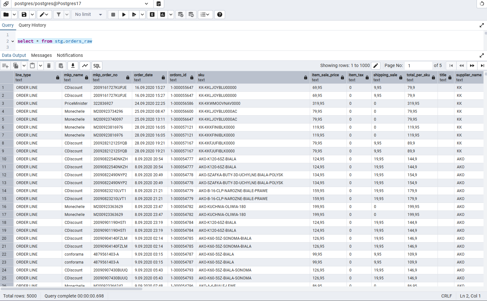
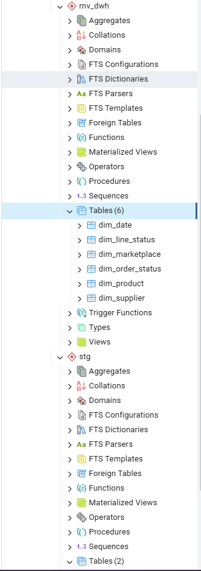
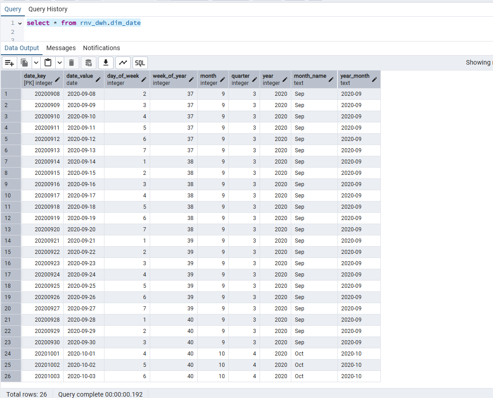
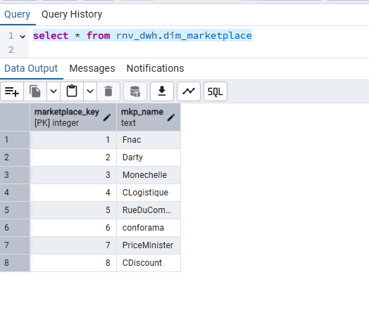
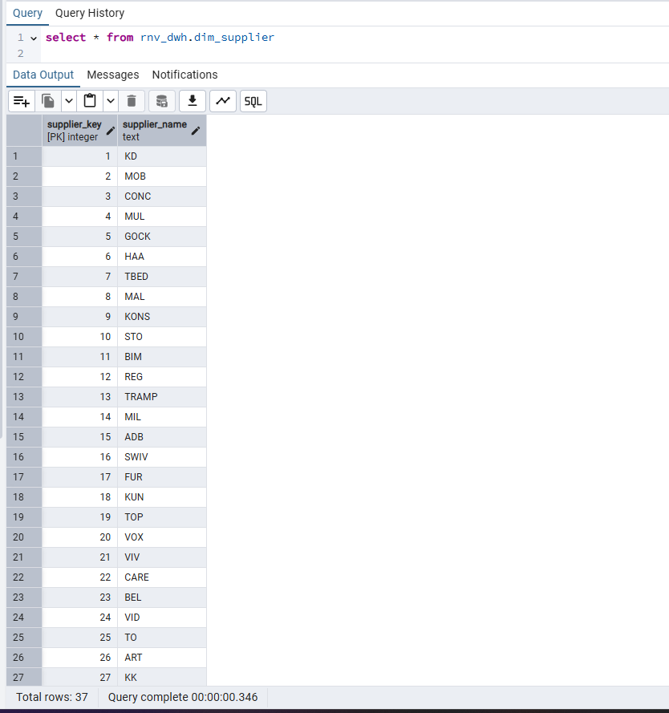
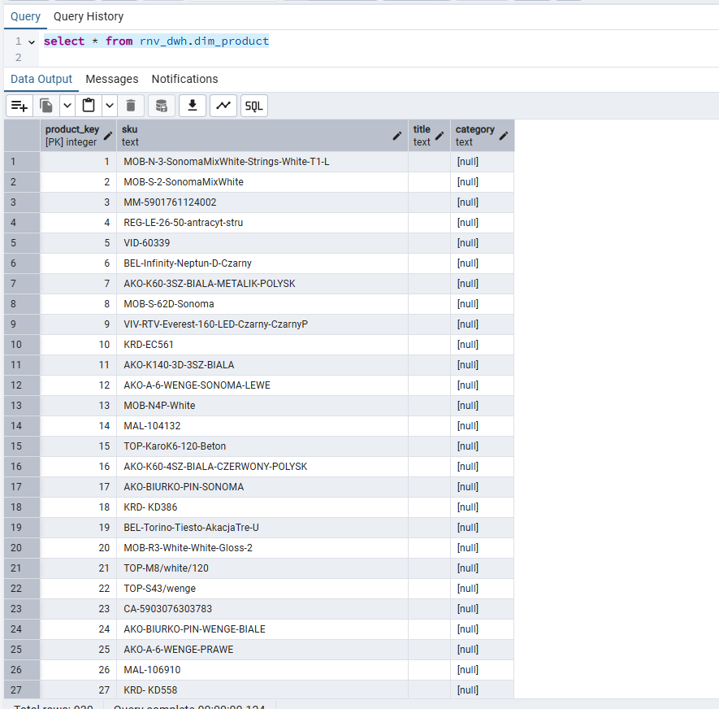
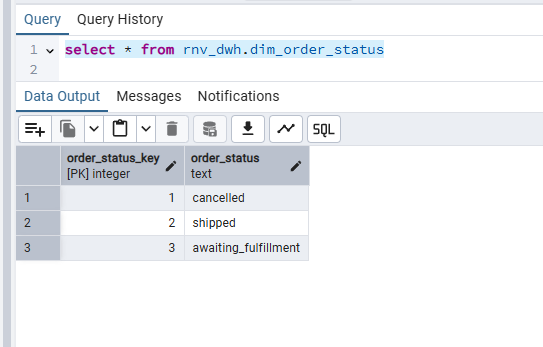
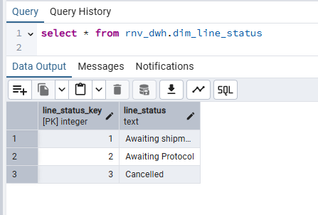
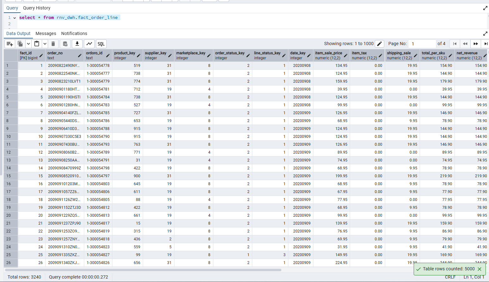
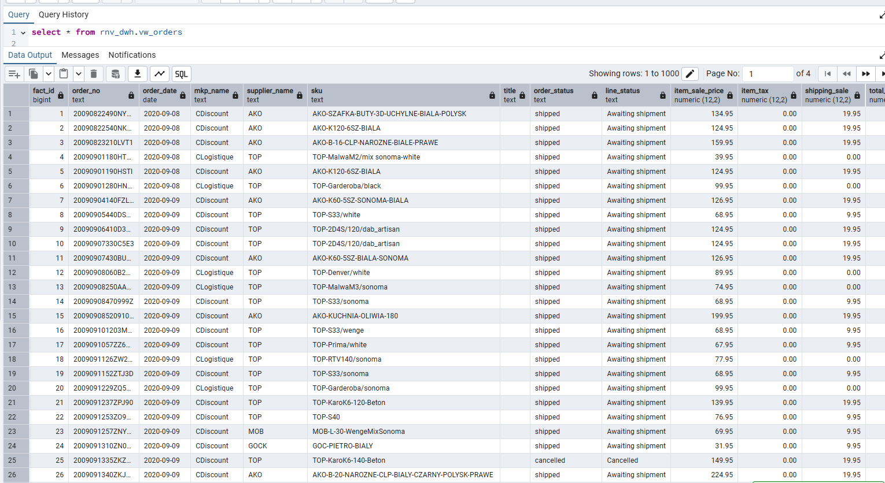

/*
Yes. I designed a star-schema DWH for the RNV dataset at order-line grain. The central fact is fact_order_line; 
the required (missing in the raw dataset) dimensions are Date, Product (SKU), Supplier, Marketplace, Order Status, Line Status.
I’m attaching PostgreSQL DDL + ELT scripts that 
(1) create schemas/tables, 
(2) load a typed staging from order.csv, 
(3) populate dimensions (including dim_date), 
(4) load the fact with a de-dup rule, and 
(5) expose a BI view for Power BI.
*/

-- You can check out my channel for installing PostgreSQL on a computer using Docker.
-- https://www.youtube.com/watch?v=jgbKBf7drZk

-- DrawIO DWH Pipeline
[Pipeline Diyagramını indir](rnv_dwh_pipeline.drawio)

-- ===============================
-- 0) SCHEMAS
-- ===============================
CREATE SCHEMA IF NOT EXISTS stg;
CREATE SCHEMA IF NOT EXISTS rnv_dwh;

-- ===============================
-- 1) STAGING (CSV -> raw text)

-- ===============================
DROP TABLE IF EXISTS stg.orders_raw;
CREATE TABLE stg.orders_raw (
  line_type                text,
  mkp_name                 text,
  mkp_order_no             text,
  order_date               text,
  ordoro_id                text,
  sku                      text,
  item_sale_price          text,
  item_tax                 text,
  shipping_sale            text,
  total_per_sku            text,
  title                    text,
  supplier_name            text,
  order_status             text,
  item_cost                text,
  cancelled_value          text,
  transport_cost_est       text,
  first_pick_date          text,
  last_delivery_date       text,
  courier                  text,
  mage_mkp_commission      text,
  mkp_estimated_commission text,
  mkp_actual_commission    text,
  order_grand_total        text,
  ordoro_import_date       text,
  tool_import_date         text,
  max_shipping_date        text,
  max_delivery_date        text,
  cd_status                text,
  is_clogistique_order     text,
  line_status              text,
  transport_cost_actual    text,
  order_place_time         text,
  order_prep_time          text,
  order_delivery_time      text,
  order_total_time         text,
  gm_estimated             text
);

-- CSV import
Target: stg.orders_raw
Format: CSV
Header: Yes
Delimiter (Separator): ; 
Quote: "

-- ===============================
-- 2) STAGING (typed) – ELT cast
-- ===============================
DROP TABLE IF EXISTS stg.orders;
CREATE TABLE stg.orders AS
SELECT
    line_type,
    mkp_name,
    mkp_order_no,

    CASE
      WHEN NULLIF(order_date,'') ~ '^\d{1,2}\.\d{1,2}\.\d{4}(\s+\d{1,2}:\d{2}(:\d{2})?)?$'
        THEN to_timestamp(order_date,
               CASE WHEN order_date ~ ':\d{2}:\d{2}$'
                    THEN 'DD.MM.YYYY HH24:MI:SS'
                    ELSE 'DD.MM.YYYY HH24:MI'
               END)
      ELSE NULL
    END::timestamp AS order_date,

    ordoro_id,
    sku,

    CASE WHEN NULLIF(item_sale_price,'') ~ '^-?\d+(,\d+)?$'
         THEN REPLACE(item_sale_price, ',', '.')::numeric(12,2) END AS item_sale_price,
    CASE WHEN NULLIF(item_tax,'')        ~ '^-?\d+(,\d+)?$'
         THEN REPLACE(item_tax, ',', '.')::numeric(12,2)        END AS item_tax,
    CASE WHEN NULLIF(shipping_sale,'')   ~ '^-?\d+(,\d+)?$'
         THEN REPLACE(shipping_sale, ',', '.')::numeric(12,2)   END AS shipping_sale,
    CASE WHEN NULLIF(total_per_sku,'')   ~ '^-?\d+(,\d+)?$'
         THEN REPLACE(total_per_sku, ',', '.')::numeric(12,2)   END AS total_per_sku,

    title,
    supplier_name,
    order_status,

    CASE WHEN is_clogistique_order IN ('1','true','TRUE') THEN true ELSE false END AS is_clogistique_order,
    line_status,

    CASE WHEN NULLIF(transport_cost_actual,'') ~ '^-?\d+(,\d+)?$'
         THEN REPLACE(transport_cost_actual, ',', '.')::numeric(12,2) END AS transport_cost_actual,

    CASE
      WHEN NULLIF(order_place_time,'') ~ '^\d{1,2}\.\d{1,2}\.\d{4}(\s+\d{1,2}:\d{2}(:\d{2})?)?$'
        THEN to_timestamp(order_place_time,
               CASE WHEN order_place_time ~ ':\d{2}:\d{2}$'
                    THEN 'DD.MM.YYYY HH24:MI:SS'
                    ELSE 'DD.MM.YYYY HH24:MI'
               END)
      ELSE NULL
    END::timestamp AS order_place_time,

    CASE
      WHEN NULLIF(order_prep_time,'') ~ '^\d{1,2}\.\d{1,2}\.\d{4}(\s+\d{1,2}:\d{2}(:\d{2})?)?$'
        THEN to_timestamp(order_prep_time,
               CASE WHEN order_prep_time ~ ':\d{2}:\d{2}$'
                    THEN 'DD.MM.YYYY HH24:MI:SS'
                    ELSE 'DD.MM.YYYY HH24:MI'
               END)
      ELSE NULL
    END::timestamp AS order_prep_time,

    CASE
      WHEN NULLIF(order_delivery_time,'') ~ '^\d{1,2}\.\d{1,2}\.\d{4}(\s+\d{1,2}:\d{2}(:\d{2})?)?$'
        THEN to_timestamp(order_delivery_time,
               CASE WHEN order_delivery_time ~ ':\d{2}:\d{2}$'
                    THEN 'DD.MM.YYYY HH24:MI:SS'
                    ELSE 'DD.MM.YYYY HH24:MI'
               END)
      ELSE NULL
    END::timestamp AS order_delivery_time,

    CASE
      /* -15 gibi pozitif/negatif sadece saniye değerleri */
      WHEN NULLIF(order_total_time,'') ~ '^-?\d+$'
        THEN (order_total_time || ' seconds')::interval
      /* 01:23:45, -01:23:00 gibi saat formatları */
      WHEN NULLIF(order_total_time,'') ~ '^-?\d{1,2}:\d{2}(:\d{2})?$'
        THEN order_total_time::interval
      ELSE NULL
    END AS order_total_time,

    CASE WHEN NULLIF(gm_estimated,'') ~ '^-?\d+(,\d+)?$'
         THEN REPLACE(gm_estimated, ',', '.')::numeric(12,2) END AS gm_estimated
FROM stg.orders_raw;

-- Remove Null Date
DELETE FROM stg.orders WHERE order_date IS NULL;

ANALYZE stg.orders;

-- ===============================
-- 3) DIMENSIONS (DDL)
-- ===============================
CREATE TABLE IF NOT EXISTS rnv_dwh.dim_date (
  date_key     INT PRIMARY KEY,              -- YYYYMMDD
  date_value   DATE NOT NULL UNIQUE,
  day_of_week  INT,
  week_of_year INT,
  month        INT,
  quarter      INT,
  year         INT,
  month_name   TEXT,
  year_month   TEXT
);

CREATE TABLE IF NOT EXISTS rnv_dwh.dim_marketplace (
  marketplace_key INT GENERATED ALWAYS AS IDENTITY PRIMARY KEY,
  mkp_name        TEXT UNIQUE NOT NULL
);

CREATE TABLE IF NOT EXISTS rnv_dwh.dim_supplier (
  supplier_key INT GENERATED ALWAYS AS IDENTITY PRIMARY KEY,
  supplier_name TEXT UNIQUE NOT NULL
);

CREATE TABLE IF NOT EXISTS rnv_dwh.dim_product (
  product_key INT GENERATED ALWAYS AS IDENTITY PRIMARY KEY,
  sku         TEXT UNIQUE NOT NULL,
  title       TEXT,
  category    TEXT
);

CREATE TABLE IF NOT EXISTS rnv_dwh.dim_order_status (
  order_status_key INT GENERATED ALWAYS AS IDENTITY PRIMARY KEY,
  order_status     TEXT UNIQUE NOT NULL
);

CREATE TABLE IF NOT EXISTS rnv_dwh.dim_line_status (
  line_status_key INT GENERATED ALWAYS AS IDENTITY PRIMARY KEY,
  line_status     TEXT UNIQUE NOT NULL
);

-- ===============================
-- 4) FACT (DDL)
-- ===============================
CREATE TABLE IF NOT EXISTS rnv_dwh.fact_order_line (
  fact_id               BIGINT GENERATED ALWAYS AS IDENTITY PRIMARY KEY,
  order_no              TEXT NOT NULL,
  ordoro_id             TEXT,

  product_key           INT REFERENCES rnv_dwh.dim_product(product_key),
  supplier_key          INT REFERENCES rnv_dwh.dim_supplier(supplier_key),
  marketplace_key       INT REFERENCES rnv_dwh.dim_marketplace(marketplace_key),
  order_status_key      INT REFERENCES rnv_dwh.dim_order_status(order_status_key),
  line_status_key       INT REFERENCES rnv_dwh.dim_line_status(line_status_key),

  date_key              INT REFERENCES rnv_dwh.dim_date(date_key),

  item_sale_price       NUMERIC(12,2),
  item_tax              NUMERIC(12,2),
  shipping_sale         NUMERIC(12,2),
  total_per_sku         NUMERIC(12,2),

  net_revenue           NUMERIC(12,2),
  transport_cost_actual NUMERIC(12,2),
  gross_margin_est      NUMERIC(12,2),

  order_place_time      TIMESTAMP,
  order_prep_time       TIMESTAMP,
  order_delivery_time   TIMESTAMP,
  order_total_time      INTERVAL,

  is_clogistique_order  BOOLEAN,

  UNIQUE (order_no, product_key) 
);

CREATE INDEX IF NOT EXISTS ix_fol_datekey     ON rnv_dwh.fact_order_line(date_key);
CREATE INDEX IF NOT EXISTS ix_fol_marketplace ON rnv_dwh.fact_order_line(marketplace_key);
CREATE INDEX IF NOT EXISTS ix_fol_supplier    ON rnv_dwh.fact_order_line(supplier_key);
CREATE INDEX IF NOT EXISTS ix_fol_status      ON rnv_dwh.fact_order_line(order_status_key);

-- ===============================
-- 5) POPULATE DIM_DATE (according to min/max)
-- ===============================
WITH b AS (
  SELECT 
    date_trunc('day', MIN(order_date))::date AS start_dt,
    date_trunc('day', MAX(order_date))::date AS end_dt
  FROM stg.orders
),
d AS (
  SELECT generate_series((SELECT start_dt FROM b), (SELECT end_dt FROM b), interval '1 day')::date AS d
)
INSERT INTO rnv_dwh.dim_date (date_key, date_value, day_of_week, week_of_year, month, quarter, year, month_name, year_month)
SELECT 
  (EXTRACT(YEAR FROM d)::int*10000 + EXTRACT(MONTH FROM d)::int*100 + EXTRACT(DAY FROM d)::int) AS date_key,
  d AS date_value,
  EXTRACT(ISODOW FROM d)::int AS day_of_week,
  EXTRACT(WEEK FROM d)::int AS week_of_year,
  EXTRACT(MONTH FROM d)::int AS month,
  EXTRACT(QUARTER FROM d)::int AS quarter,
  EXTRACT(YEAR FROM d)::int AS year,
  TO_CHAR(d,'Mon')  AS month_name,
  TO_CHAR(d,'YYYY-MM') AS year_month
FROM d
ON CONFLICT (date_key) DO NOTHING;

-- ===============================
-- 6) POPULATE OTHER DIMENSIONS (UPSERT)
-- ===============================
INSERT INTO rnv_dwh.dim_marketplace(mkp_name)
SELECT DISTINCT mkp_name FROM stg.orders WHERE mkp_name IS NOT NULL
ON CONFLICT (mkp_name) DO NOTHING;

INSERT INTO rnv_dwh.dim_supplier(supplier_name)
SELECT DISTINCT supplier_name FROM stg.orders WHERE supplier_name IS NOT NULL
ON CONFLICT (supplier_name) DO NOTHING;

INSERT INTO rnv_dwh.dim_product(sku, title)
SELECT DISTINCT sku, title FROM stg.orders WHERE sku IS NOT NULL
ON CONFLICT (sku) DO UPDATE SET title = EXCLUDED.title;

INSERT INTO rnv_dwh.dim_order_status(order_status)
SELECT DISTINCT order_status FROM stg.orders WHERE order_status IS NOT NULL
ON CONFLICT (order_status) DO NOTHING;

INSERT INTO rnv_dwh.dim_line_status(line_status)
SELECT DISTINCT line_status FROM stg.orders WHERE line_status IS NOT NULL
ON CONFLICT (line_status) DO NOTHING;

-- ===============================
-- 7) LOAD FACT (de-dup: latest per (order, sku))
-- ===============================
WITH ranked AS (
  SELECT
    o.*,
    ROW_NUMBER() OVER (PARTITION BY o.mkp_order_no, o.sku ORDER BY o.order_date DESC NULLS LAST) AS rn
  FROM stg.orders o
)
INSERT INTO rnv_dwh.fact_order_line (
  order_no, ordoro_id, product_key, supplier_key, marketplace_key,
  order_status_key, line_status_key, date_key,
  item_sale_price, item_tax, shipping_sale, total_per_sku,
  net_revenue, transport_cost_actual, gross_margin_est,
  order_place_time, order_prep_time, order_delivery_time, order_total_time,
  is_clogistique_order
)
SELECT
  r.mkp_order_no,
  r.ordoro_id,
  p.product_key,
  s.supplier_key,
  m.marketplace_key,
  os.order_status_key,
  ls.line_status_key,
  (EXTRACT(YEAR FROM r.order_date)::int*10000
   + EXTRACT(MONTH FROM r.order_date)::int*100
   + EXTRACT(DAY FROM r.order_date)::int) AS date_key,

  r.item_sale_price, r.item_tax, r.shipping_sale, r.total_per_sku,
  COALESCE(r.total_per_sku,0) - COALESCE(r.item_tax,0)                                      AS net_revenue,
  r.transport_cost_actual,
  (COALESCE(r.total_per_sku,0) - COALESCE(r.item_tax,0)) - COALESCE(r.transport_cost_actual,0) AS gross_margin_est,

  r.order_place_time, r.order_prep_time, r.order_delivery_time, r.order_total_time,
  r.is_clogistique_order
FROM ranked r
LEFT JOIN rnv_dwh.dim_product      p  ON p.sku = r.sku
LEFT JOIN rnv_dwh.dim_supplier     s  ON s.supplier_name = r.supplier_name
LEFT JOIN rnv_dwh.dim_marketplace  m  ON m.mkp_name = r.mkp_name
LEFT JOIN rnv_dwh.dim_order_status os ON os.order_status = r.order_status
LEFT JOIN rnv_dwh.dim_line_status  ls ON ls.line_status = r.line_status
WHERE r.rn = 1
ON CONFLICT (order_no, product_key) DO NOTHING;

ANALYZE rnv_dwh.fact_order_line;

-- ===============================
-- 8) BI VIEW (For Power BI)
-- ===============================
CREATE VIEW rnv_dwh.vw_orders AS
SELECT
  f.fact_id,
  f.order_no,
  d.date_value::date           AS order_date,
  mk.mkp_name,
  sp.supplier_name,
  pr.sku,
  pr.title,
  os.order_status,
  ls.line_status,
  f.item_sale_price,
  f.item_tax,
  f.shipping_sale,
  f.total_per_sku,
  f.net_revenue,
  f.transport_cost_actual,
  f.gross_margin_est
FROM rnv_dwh.fact_order_line f
LEFT JOIN rnv_dwh.dim_date         d  ON d.date_key = f.date_key
LEFT JOIN rnv_dwh.dim_marketplace  mk ON mk.marketplace_key = f.marketplace_key
LEFT JOIN rnv_dwh.dim_supplier     sp ON sp.supplier_key = f.supplier_key
LEFT JOIN rnv_dwh.dim_product      pr ON pr.product_key = f.product_key
LEFT JOIN rnv_dwh.dim_order_status os ON os.order_status_key = f.order_status_key
LEFT JOIN rnv_dwh.dim_line_status  ls ON ls.line_status_key = f.line_status_key;

-- ===============================
-- 9) QUICK QA
-- ===============================
-- Sum row
SELECT COUNT(*) AS fact_rows FROM rnv_dwh.fact_order_line;
--Answer
3240

-- dim_date (gerekli)
-- dim_product (SKU/title/category) (gerekli)
-- dim_supplier (gerekli)
-- dim_marketplace (mkp_name) (gerekli)
-- dim_order_status (gerekli)
-- dim_line_status (gerekli)

